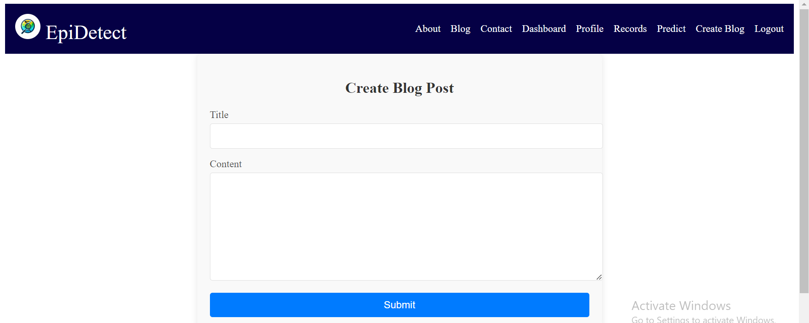

# EpiDetect

EpiDetect is a web application developed using the MERN stack, designed to predict skin diseases from images captured using your web camera. It uses a fine-tuned ResNet50 model for accurate skin disease detection.

## Features

- **User Profile Management**: Users can view and update their profile information.
- **Skin Disease Prediction**: Upload or capture images using the web camera to predict skin diseases.
- **Dashboard**: Access different functionalities from a central dashboard.
- **Blog Creation**: Users can create and manage their blog posts.
- **Contact Form**: Users can send messages through the contact form.
- **Prediction Records**: View and download prediction records in PDF format.

## Screenshots

### User Profile


### Predict Skin Disease


### Contact Us


### Dashboard


### Prediction Records


### Create Blog Post


### Login


## Technology Stack

- **Frontend**: React.js, HTML, CSS
- **Backend**: Node.js, Express.js
- **Database**: MongoDB
- **Machine Learning**: Python, TensorFlow, Keras (ResNet50 model)
- **Other Tools**: JWT for authentication, multer for file uploads

## Setup Instructions

### Prerequisites

- Node.js
- MongoDB
- Python
- TensorFlow and Keras

### Installation

1. Clone the repository:
    ```sh
    git clone https://github.com/fatimaazfar/EpiDetect.git
    ```

2. Navigate to the project directory:
    ```sh
    cd EpiDetect
    ```

3. Install backend dependencies:
    ```sh
    cd server
    npm install
    ```

4. Install frontend dependencies:
    ```sh
    cd ../client
    npm install
    ```

5. Set up environment variables for server:
    - Create a `.env` file in the `server` directory.
    - Add the following environment variables:
      ```env
      MONGO_URI=your_mongodb_connection_string
      JWT_SECRET=your_jwt_secret
      ```

6. Run the backend server:
    ```sh
    cd ../server
    node server.js
    ```

7. Run the frontend server:
    ```sh
    cd ../client
    npm start
    ```

8. Access the application at `http://localhost:3000`.

## Usage

1. **User Registration and Login**: Register a new account or log in with existing credentials.
2. **Profile Management**: View and update your profile information.
3. **Skin Disease Prediction**:
   - Navigate to the `Predict` page.
   - Upload an image or capture one using your web camera.
   - Click on `Predict` to get the prediction results.
4. **Blog Creation**: Navigate to the `Create Blog` page to create and manage your blog posts.
5. **Contact Us**: Use the contact form to send messages.
6. **Prediction Records**: View and download your prediction records in PDF format.

## Future Work
I will soon be incorporating a chatbot to recommend natural solutions and treatments for light-scale skin diseases, causes of the disease, and anything relevant to the disease that the patient could find useful.

## Contributing

Contributions are welcome! Please fork the repository and submit a pull request for any improvements or bug fixes.

## License

This project is licensed under the MIT License. See the [LICENSE](./LICENSE) file for details.

## Contact

For any inquiries, please contact Fatima Azfar at fatimaazfar381@gmail.com.
